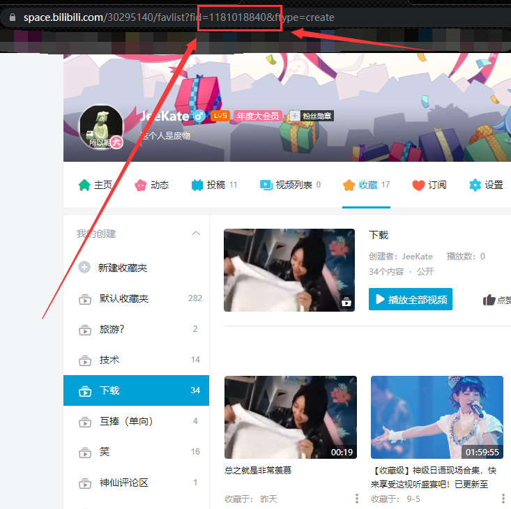
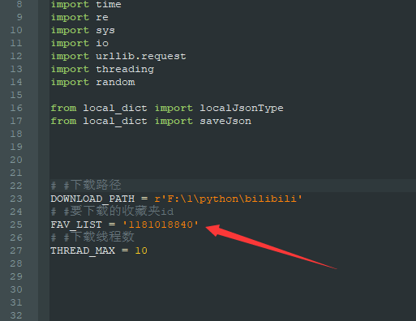
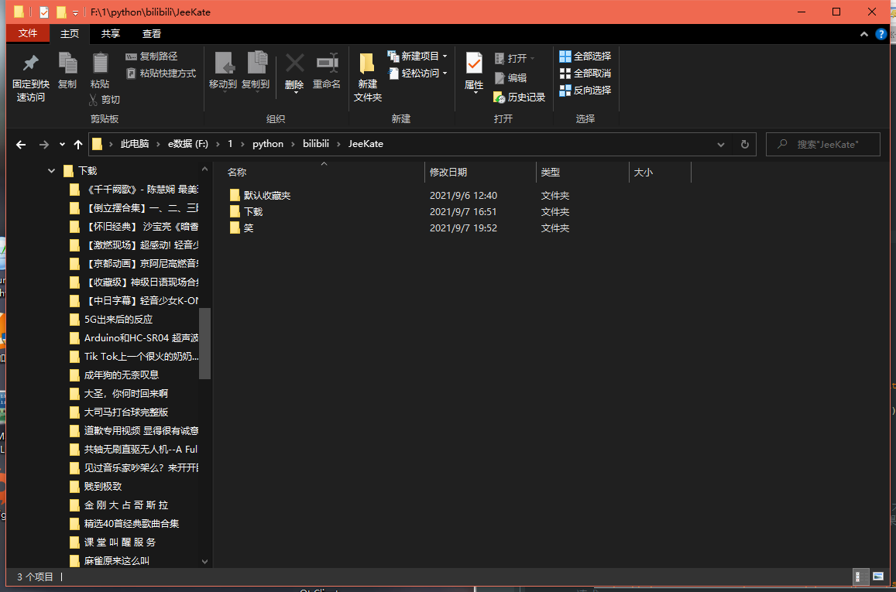

# (BFD)Bilibili Favorite Downloader v0.0.1
# 本项目仅供个人交流学习使用，禁止用于商业用途。使用此脚本造成的一切纠纷本人概不负责
## 1.简介
### 功能&特性
#### -1- 按收藏夹名整理视频，分p视频保存在标题同名文件夹，视频标题为对应p视频标题
#### -2- 多线程下载
#### -3- 增量下载，收藏夹视频删减仍保留本地视频
#### -4- xml格式弹幕下载，flv/MP4格式可选下载(MP4格式需要mmpeg4工具混流)
#### -5- 本地保留收藏夹信息原始数据
### 1.1环境
#### -1- python3
#### -2- you-get
#### -3- requests
## 2.使用方法
#### -1- 登录B站，打开想要下载到本地的收藏夹。复制浏览器地址栏的收藏夹id(纯数字)
#### -2- 打开 bilibili.py ，修改以三个参数
```
        
        DOWNLOAD_PATH    ：# #下载路径
        
        FAV_LIST         ：# #要下载的收藏夹id

        THREAD_MAX       ：# #同时下载的视频数
```

#### -3- 双击运行
#### 多个收藏夹下载结果如图
## 3.注意事项
#### --暂不支持断点续传，请确保脚本运行后网络稳定
#### --若下载时脚本异常退出，或其他原因导致下载中断，请删除收藏夹文件夹下的raw.json
#### --如果you-get提示报错，可能是触发了B站反爬机制，建议更换ip
#### --此脚本暂处于测试阶段，建议不要下载视频过多(>100)的收藏夹
## 4.有希望的
#### --接入阿里云盘和RSS，实现真·自动下载收藏夹视频
#### --加入断点续传
#### --下载信息通过QQ机器人或邮箱发送
